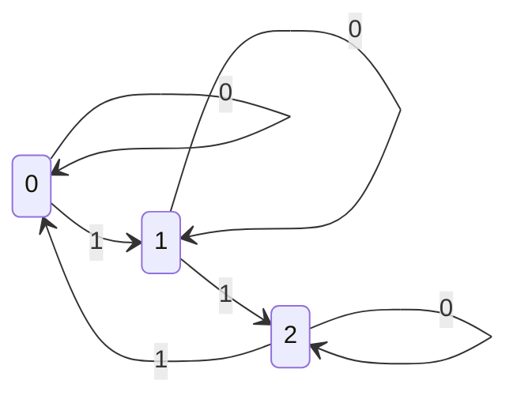
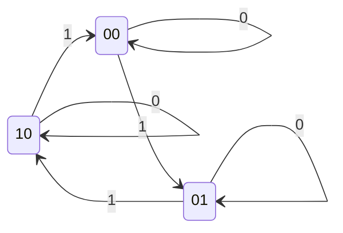

# 力扣（LeetCode）

> 选自[力扣](https://leetcode.cn)

## 137. 只出现一次的数字 II

> [【LeetCode#137】只出现一次的数字 II](https://leetcode.cn/problems/single-number-ii/)
>
> 给你一个整数数组 nums ，除某个元素仅出现**一次**外，其余每个元素都恰出现**三次**。请你找出并返回那个只出现了**一次**的元素。你必须设计并实现线性时间复杂度的算法且不使用额外空间来解决此问题。
>
> - 示例 1：
>
>   - 输入：nums = [2,2,3,2]
>   - 输出：3
>
> - 示例 2：
>
>   - 输入：nums = [0,1,0,1,0,1,99]
>   - 输出：99
>
> - 提示：
>
>   - $1 \le nums.length \le 3 * 10^4$
>   - $-2^{31}\le nums[i] \le 2^{31} - 1$
>   - $nums$ 中，除某个元素仅出现**一次**外，其余每个元素都恰出现**三次**

### 分析

本题为[【LeetCode#136】只出现一次的数字](https://leetcode.cn/problems/single-number/?envType=study-plan&id=shu-ju-jie-gou-ji-chu&plan=data-structures&plan_progress=b00nos7)的进阶版，除只出现一次的元素外其他元素的出现次数由**两次**提升为**三次。**

在只出现一次的数字中，我们采用位运算异或的方式很方便地处理每位0、1两个状态的相互转换，所以我们可以得到一种时间复杂度较低的线性方法。在本题中我们也可以用类似的思路去处理，但由于没有现成的位运算来进行三态的转换，我们需要用较为暴力的方法或自己设计出一种运算符。

### 解法一 暴力按位统计

我们将所有数按二进制表示后，如果某一位的出现次数除3余1时，则说明该位数包含在仅出现一次的数中。

这个思路实际上类似于一种二分的思想，因此该算法的时间复杂度实际为$O(n*\log{max\_num})$。但整数的大小是有限的不随数据量的位数增大而增大，因此可以当作常数考虑，也就是说该算法是可以认为是线性的。

### 解法二 有限状态自动机

二进制数各位的位运算规则相同，因此只需要按其中一位考虑即可，状态转换如图所示。



我们可以用两位二进制树来表示这三种状态，得到的新的状态转换图如下：



分别用$A$和$B$表示两位二进制数，则每个状态均为$AB$。根据上边状态转换图，当输入二进制数x的时候，我们可以得到这样的伪代码：

```python
# 计算B
if A == 0:
    if x == 0:
        B = B
    else:
        B = ~B
else:
    B = 0
# 计算A
if B == 0:
    if x == 0:
        A = A
    else:
        A = 0
else:
    if x == 0:
        A = ~A
    else:
        A = A
```

引入其他位运算符后，可以得到如下计算式：

```python
B = B ^ x & ~A
A = A ^ x & ~B
```

将每个数进行上述运算后，最终的结果即为所求。

该方法将为难理解，也可以用数字电路的方式来理解。（待补充）
